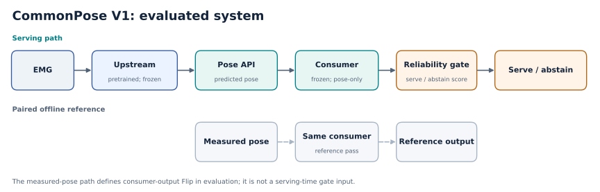
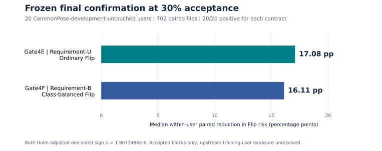

# CommonPose V1 — Reliability-Aware EMG-to-Pose Substitution

**Public research release.** CommonPose V1 asks whether a predicted physical hand-state interface can replace measured pose for an independently trained downstream consumer, and whether deployment-visible reliability scores can reduce the consumer's substitution risk by serving only selected blocks.

## Research question and system

EMG → frozen pretrained EMG-to-pose upstream → predicted joint-angle state → frozen pose-only downstream consumer → reliability gate → serve or abstain. A paired reference path feeds measured pose to the *same* consumer. The consumer was trained independently on DB9 posture data; the V1 evaluation did not retrain it on the final emg2pose outcomes.

This matters because named physical-state coordinates do not guarantee reliable downstream decisions when measured pose is replaced by estimated pose. The gate estimates when a specific frozen consumer is less likely to change its output. [Architecture](docs/architecture.md) explains the measurement boundary.

## Experimental chain

Gate4C characterized heterogeneous substitution on a frozen validation cohort. Gate4D developed a continuous task-space reliability signal on development users. Gate4E and Gate4F then froze two different consumer-output reliability contracts before a joint final confirmation on users untouched by CommonPose scientific development. See the [methods chain](docs/gate4c_to_final_chain.md) and [timeline](docs/experiment_timeline.md).

## Final confirmation

The frozen final cohort contained **20 CommonPose-development-untouched users and 702 paired files**. At fixed **30% within-user acceptance**:

| Contract | Target risk | Median paired user improvement, full coverage to accepted blocks | Positive users | Holm-adjusted one-sided sign p |
|---|---|---:|---:|---:|
| Gate4E Requirement-U | Ordinary, usage-weighted Flip | **17.08 percentage points** | 20/20 | 1.9073486e-6 |
| Gate4F Requirement-B | Class-balanced Flip | **16.11 percentage points** | 20/20 | 1.9073486e-6 |

Flip means the frozen consumer's output differs between predicted and measured pose. The 30% metrics describe accepted blocks only; about 70% of eligible blocks per user were abstained from. These are distinct reliability contracts, not a contest for one universal gate. Gate4E's secondary balanced risk rose, while Gate4F's secondary ordinary risk rose. [Aggregate results](results/README.md) provide exact values and denominators.

## Claim boundaries

- The final users were untouched by **CommonPose scientific development**. The frozen upstream checkpoint's training-user membership is unresolved; upstream-unseen generalization is unproven.
- Flip is downstream consumer-output substitution disagreement, **not** human semantic gesture error or human-label accuracy.
- Selective ACC at 30% coverage applies only to accepted blocks and is **not** full-coverage system ACC.
- The result concerns one official paired data family, one frozen upstream path, and one independently trained consumer. Cross-source calibration equivalence, universal API generalization, population-wide reliability, streaming operation, and clinical or product safety are unestablished.
- The two gates optimize different customer requirements. Their secondary tradeoffs and residual absolute risks remain material.

Read the [scientific state](docs/v1_final_scientific_state.md) and [claim–evidence matrix](docs/claim_evidence_matrix.md) before reusing a result. The [repository map](docs/repo_map.md) lists the public materials. This repository is a curated public summary, with no raw data, model binaries, participant-level records, or executable gate implementation. [Data availability](DATA_AVAILABILITY.md), [third-party notices](THIRD_PARTY_NOTICES.md), and [reuse and license status](REUSE_STATUS.md) explain access and reuse limits.

## Project lead / maintainer

**Name:** Boyan Dong  
**Role:** Undergraduate Researcher in Biomedical Engineering  
**Affiliation:** Southeast University  
**Research interests:** biosignal processing, wearable sensing, human–computer interaction, human augmentation  
**Contact:** [@boyandong](https://github.com/boyandong)
